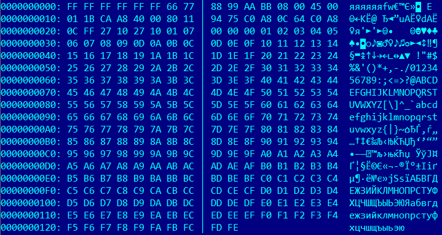

# generator_udp_packet
Generator UDP packet header to BIN FILE, for TX packet from FPGA board.

run:
generator_udp_packet.exe ffffffffffff 66778899aabb 192.168.12.255 192.168.12.100 10000 10000 255 udp_out.bin

result (BIN file):

